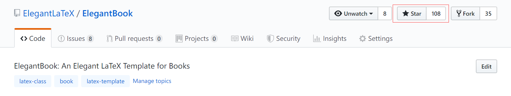

The number of stars on Github for ElegantBook reached 100 on May 20, 2019 and was included in the [Trending](https://github.com/trending/tex?since=daily) under the TeX category. It is a remarkable moment for ElegantLaTeX!!!

Thank ChinaTeX and [LaTeX studio](http://www.latexstudio.net/) for their promotion. LaTeX studio offers tons of valuable posts and templates for discovery. It is the most comprehensive website on LaTeX in China.

Thank  [muzimuzhi](https://github.com/muzimuzhi) for the revision of the template.

If you like our template, star on Github.

Recently some users have expressed their love for our templates and want to tip us. QR code for donation is now available.

​	

The explanation right of the tip usage belongs to ElegantLaTeX with no supervision. Feel free to tip us. Those who donate more than 10 RMB will be recorded in the Donation List. Thank all the tippers!

|      Tipper      | Amount |   Date    | Channel |
| :--------------: | :----: | :-------: | :-----: |
|       Lerh       | 10 RMB | 2019/5/15 | Wechat  |
| Yueguodipingxian | 10 RMB | 2019/5/15 | Wechat  |
|     Daxiong      | 20 RMB | 2019/5/27 | Wechat  |

