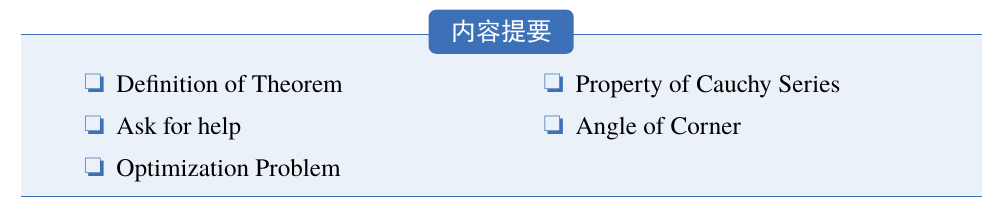

模板新增了一个章节摘要环境（introduction），使用示例

```tex
\begin{introduction}
  \item Definition of Theorem
  \item Ask for help
  \item Optimization Problem
  \item Property of Cauchy Series
  \item Angle of Corner
\end{introduction}
```

效果如下：



**注**    环境的标题文字可以通过这个环境的可选参数进行修改，修改方法为：

```tex
\begin{introduction}[Brief Introduction]
...
\end{introduction}
```


