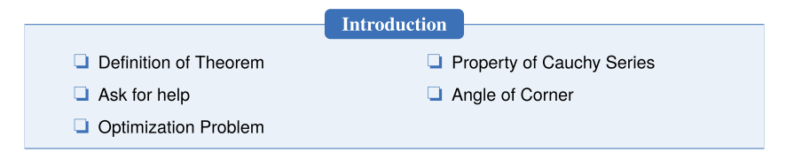

We create a introduction environment to display the structure of chapter. The basic useage is as follows

```latex
\begin{introduction}
  \item Definition of Theorem
  \item Ask for help
  \item Optimization Problem
  \item Property of Cauchy Series
  \item Angle of Corner
\end{introduction}
```

you will get:



You can change the title of this environment by modifying the optional argument of this environment.

```latex
\begin{introduction}[Brief Introduction]
...
\end{introduction}
```

